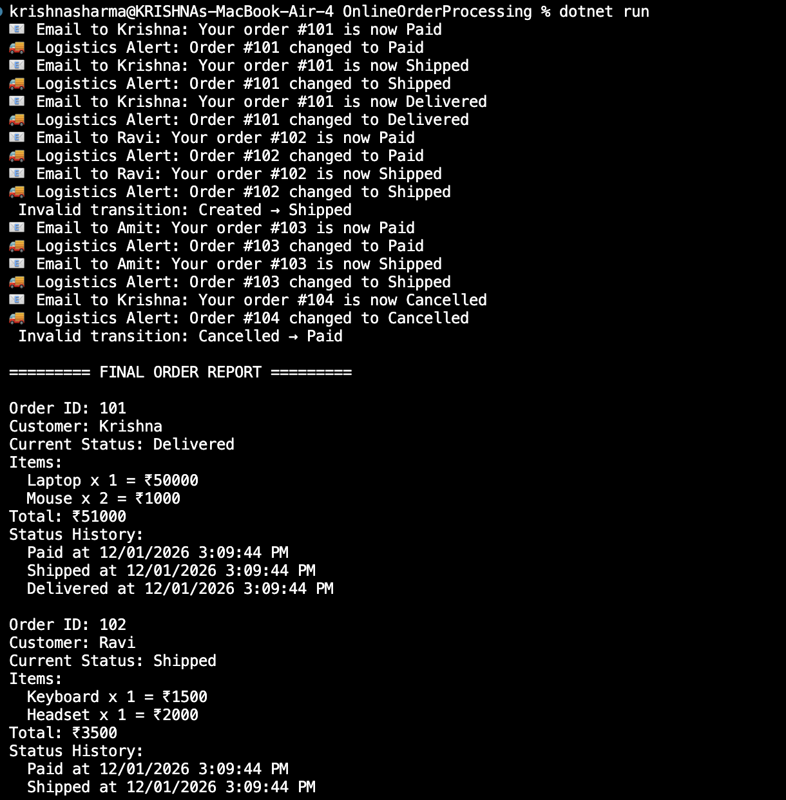

# Online-Order-Processing-Status-Notifications

This project simulates the core backend workflow of an e-commerce order management system such as Amazon or Flipkart.
It manages products, customers, orders, order status transitions, and real-time notifications using pure C# without any database or external frameworks.

The system demonstrates how a modern backend manages:

- Order life-cycle
- Business rules
- Notifications
- In-memory data storage
- Reports

Everything is implemented using Object-Oriented Programming, Generic Collections, and Delegates.


### 📝 🚀 Features
✔ Product, Customer & Order Management
✔ Multiple Items per Order (Composition)
✔ In-Memory Database using DataBank
✔ Order Status Workflow (Created → Paid → Shipped → Delivered)
✔ Business Rule Validation
✔ Multicast Delegate-based Notifications
✔ Status History Tracking
✔ Full Order Summary & Reports

### 🔧 Key Concepts Used
- Object-Oriented Programming (OOP)
- Abstraction & Inheritance
- Polymorphism
- Delegate Usage
- Collections (List<T>)
- Static Utility Class
- Menu-driven Console Interaction
- Input Validation

### Output



### 🚀 Future Enhancements

- Add persistent storage using files or a database to store products, customers, and orders permanently
- Implement order edit, cancellation, and refund workflows
- Add date-based filtering to generate daily, weekly, or monthly sales and delivery reports
- Expose the system as an ASP.NET Web API to support web and mobile frontends
- Add unit tests for order totals, status transitions, and notification triggers
- Integrate additional notification channels such as SMS, WhatsApp, or push notifications
- Add user authentication for customers and administrators
- Implement inventory tracking and stock validation for products

---

## ▶️ How to Run the Projects

```bash
dotnet run
